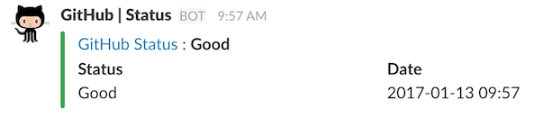

# skackposter
Post a payload to your Slack Incoming Webhook.

## Usage

You can send a message.

```go
package main

import (
	"github.com/m-nakada/slackposter"
)

func main() {
    config := slackposter.Config{
        "mn",
        ":ghost:",
        "Ghost",
        "https://hooks.slack.com/services/xxxx/xxx/xxx",
    }

    slack := slackposter.NewSlack(config)
    slack.PostMessage("Hello world!")
}
```


You can send a customized message (payload).
Please refer to [examples/example_payload.go](https://github.com/m-nakada/slackposter/blob/examples/examples/example_payload.go)


